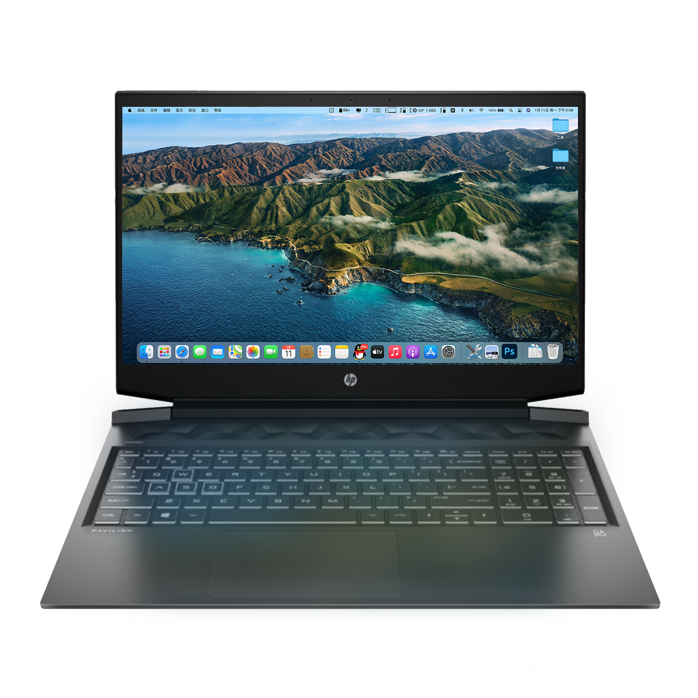

[中文](https://github.com/zzzyy678/-Pavilion--16-a0001tx-Hackintosh) | **English**
## HP Pavilion--16-a0001tx-Hackintosh
[](https://github.com/zzzyy678/-Pavilion--16-a0001tx-Hackintosh/releases)

 

- macOS10.15 Catalina：`OpenCore v0.6.8`  
  - [Download EFI](https://github.com/zzzyy678/-Pavilion--16-a0001tx-Hackintosh/releases/download/v0.6.8-oc/OCv0.6.8Catalina.zip)
- macOS12 Monterey & macOS13 Ventura：`OpenCore v0.8.8`  
  - [Download EFI](https://github.com/zzzyy678/-Pavilion--16-a0001tx-Hackintosh/releases/download/v0.8.0-oc/OC.v0.8.8.zip)
### Preparation before installing macOS：CFG-Unlock & Set DVMT to 64MB
Boot on [CFG-Lock.zip](https://github.com/zzzyy678/-Pavilion--16-a0001tx-Hackintosh/raw/main/CFG-Unlock.zip) `EFI/BOOT/BOOTX64.EFI`，enter the following two commands：
```shell
setup_var 0x3e 0x01
setup_var 0xf5 0x2
```
### Enable HIDPI
```shell
bash -c "$(curl -fsSL https://raw.githubusercontent.com/xzhih/one-key-hidpi/master/hidpi.sh)"
```
or [one-key-hidpi](https://github.com/xzhih/one-key-hidpi/archive/refs/heads/master.zip)

-----
### Configuration

| Specifications      | Detail                                 | 
| -------- | ---------------------------------------- |
| Computer model | HP Pavilion-16-a0001tx |
| Processor | Intel Core i7-10750H |
| Memory | Samsung DDR4 16GB 2933MHz  |
| Hard Disk | WDC Nvme SN720 512GB |
| iGPU | Intel UHD Graphics 630 |
| eGPU (do not work) | NVIDIA Geforce RTX2060 MAX-Q |
| Sound Card | Realtek ALC245 |
| Wireless Card | Intel AX201 |
| Network Interface Card | Realtek RTL8111 |
| Trackpad | ELAN072E |
| Sensor| Temperature sensor, Fan speed sensor |
